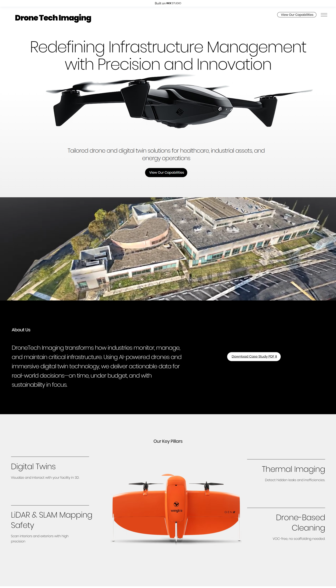

# 🛰️ Drone Tech Imaging (HJBC Global) — Wix Studio Project

This is a **real-world client website** I designed and managed using **Wix Studio**, focusing on infrastructure monitoring through **AI-powered drones** and **digital twin technology**. This project highlights my skills in modern no-code development, responsive design, SEO principles, and user-centered layout strategy.

---

## 🎯 What I Did

- 🔹 Built a multi-page, responsive business website using **Wix Studio**
- 🔹 Structured and styled professional service sections for **B2B clients**
- 🔹 Created visually impactful layouts with modern UX patterns
- 🔹 Applied SEO, accessibility, and mobile-first principles
- 🔹 Collaborated with business stakeholders to meet real use-case needs

---

## 🌐 Live Website
👉 [Visit the Site](https://hjbcglobal.wixstudio.com/drone-tech-imaging)

---

## 💼 Relevant Skills

- Wix Studio Web Design
- UI/UX Planning
- No-Code Development
- SEO & Performance Optimization
- Client Communication
- Real-World Project Delivery

---

## 🧑‍💼 Why This Project Matters for Employers

This project shows my ability to:
- Work with real clients and deliver business-ready websites
- Use modern tools like Wix Studio professionally
- Combine design, strategy, and functionality for clear client goals

---

## 📩 Contact Me

- **Email:** muhammadmuzammil0888@gmail.com
- **LinkedIn:** [Your LinkedIn Profile](https://www.linkedin.com/in/muhammad-muzammil-46a449283/?originalSubdomain=pk)

---
